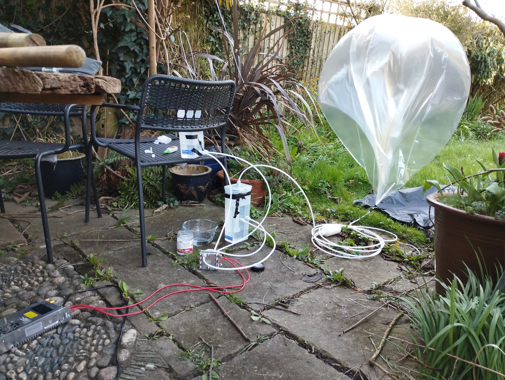
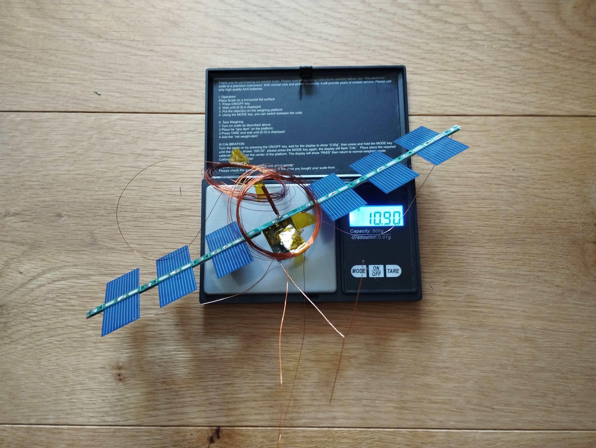
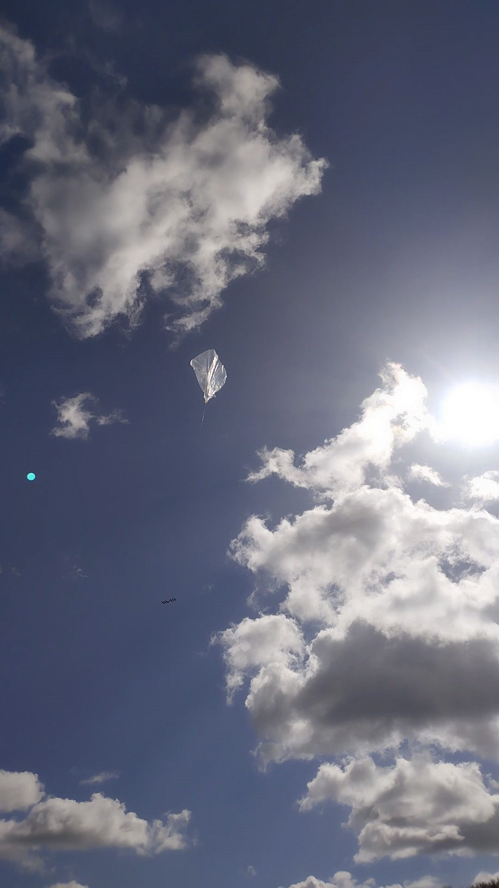

## Introduction

Pico-13 was launched on 28/03/2026 and used the same 60-inch 'cymylar' balloon and tracker that we used on Pico-11. It was also our first flight using hydrogen, which meant there were a few extra things to think about before launch.

## Balloon details
After the failure of Pico-12, we decided to play it safe and used a 6-cell horizontal panel and an LDO. We also used the 17m band, as it worked well for Pico-11.

## Hydrogen Generation

We used a 300ml/min hydrogen proton exchange membrane cell and a CV/CC power supply. The cell was supplied with distilled water and the hydrogen was bubbled through a reservoir before being passed through a bottle filled with silica beads to remove any moisture. The dry hydrogen was then collected in a storage balloon.

## Safety
After launch, we had some leftover hydrogen in the storage balloon. It proved relatively difficult to ignite through the balloon and burned very slowly once lit. This suggested that there was very little oxygen present, which was reassuring and indicated that the system was airtight enough to avoid any explosive ignition if it were accidentally lit.

## Launch Day
Launch conditions were good, with only a few clouds in the sky.

Free lift was 4.2g.

We waited until transmissions were confirmed before launching. The launch went smoothly, although there was some significant turbulence during the early part of the ascent, causing the balloon to descend from around 1300m to about 800m altitude after 20 minutes in the air. Luckily it did not descend low enough to hit the ground, and the rest of the ascent was textbook. The final float altitude was about 12.4 km.

The balloon has now been up for 33 days and has completed one lap.